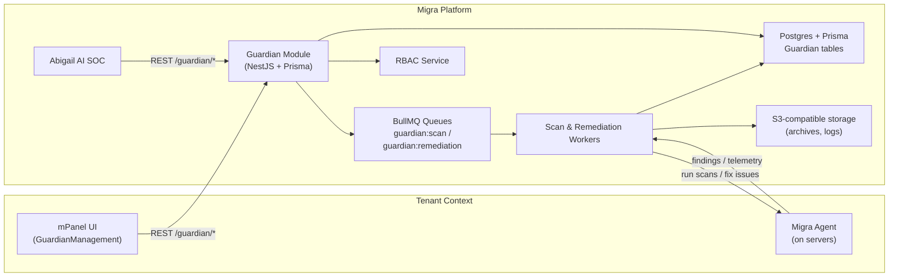

# Guardian AI – High-Level Architecture

- Tenant UI and Abigail share the same Guardian HTTP API.
- Guardian uses queues and workers to talk to agents and perform remediation.
- All actions are logged to the Guardian audit tables and optionally to centralized logging.
